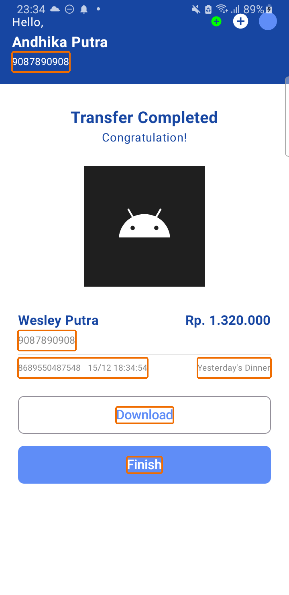
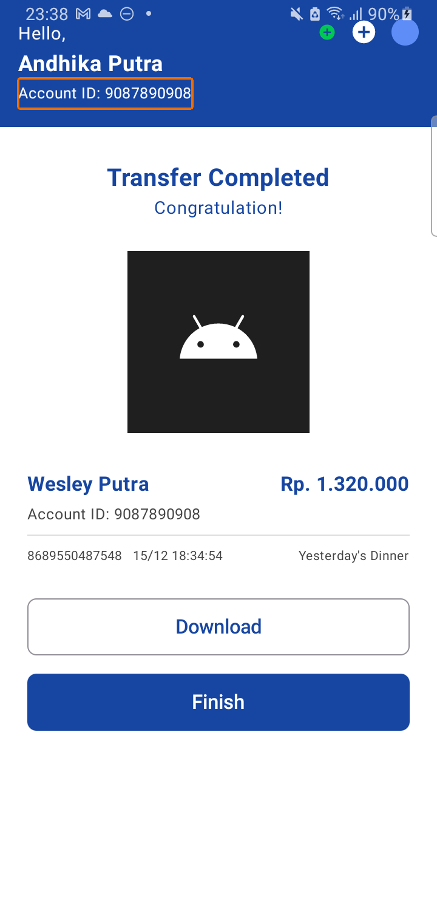

# Prompt Guide for Building Accessible UIs with Jetpack Compose and LLMs

A toolkit with example prompts to help developers create and improve accessible Jetpack Compose user interfaces using Large Language Models (LLMs).

## About This Guide

This guide was developed as part of an academic study that investigated how Large Language Models, such as ChatGPT, can assist in improving the accessibility of Android UIs created with Jetpack Compose.

The study analyzed screens generated from Figma templates and evaluated their accessibility using Google’s Accessibility Scanner. Initial results showed a high number of accessibility issues, especially related to Text Contrast and Content Descriptions. However, when using structured and specific prompts, the model was able to fix over 50% of the identified issues, demonstrating that LLMs can be a valuable tool for developers, especially when guided with clear instructions.

The goal of this guide is to share prompt examples and help other developers benefit from this approach. It includes examples for generating new screens as well as improving existing ones, all with a focus on accessibility best practices.


## What Is Digital Accessibility?

Digital accessibility is about making apps and digital content usable by everyone, including people with disabilities. This includes support for users who rely on screen readers, keyboard navigation, voice controls, and other assistive technologies.

In mobile development, accessibility means designing interfaces that are easy to perceive, understand, and interact with, regardless of a user’s visual, auditory, cognitive, or motor abilities.

### Common Accessibility Mistakes to Watch For

When generating code with LLMs, here are the most common accessibility violations to look out for:

- **Low text contrast**: Ensure sufficient contrast between text and background.
- **Missing content descriptions**: All interactive elements (buttons, switches, images) need meaningful `contentDescription`.
- **Unlabeled items**: Avoid using empty `Text("")` or decorative icons without context.
- **Small touch targets**: Ensure buttons and icons have a minimum touch target of 48x48dp.
- **Incorrect semantic roles**: Use `.semantics { }` properly to expose meaningful information to assistive technologies.

Use tools like Android's Accessibility Scanner to detect these and revise your prompts accordingly.

### 📘 Learn More

- [W3C Web Content Accessibility Guidelines (WCAG)](https://www.w3.org/WAI/standards-guidelines/wcag/)
- [Android Accessibility Developer Guide](https://developer.android.com/guide/topics/ui/accessibility)
- [Material Design Accessibility](https://m3.material.io/foundations/overview/principles)


##  Why Use LLMs for Accessibility?

The examples below show screenshots of screens before and after accessibility improvements were applied using ChatGPT prompts. Each screen was scanned using Google’s Accessibility Scanner to identify common issues. After applying the recommended changes, the updated screens were rescanned to verify improvements.





#### You can also check the code behind these examples:

- [Before](./examples/screen_before.kt)
- [After](./examples/screen_after.kt)
## How to Prompt LLMs to Build and Improve Accessible Screens

When prompting a language model like ChatGPT, a detailed input can help you achieve your desired response.

### Rules of Thumb
Here are some practical guidelines to follow in order to improve your prompt:

- **Provide context**: LLMs rely heavily on context. The more you provide, such as code, UI descriptions, or specific problems that need to be solved, the more relevant and accurate the output will be.

- **Be specific, make your goal clear**: Be specific about what you want the model to do. Instead of giving a short command, try going into detail about what is your problem, what needs to be done and how you'd like it to do it.

- **Use roleplay**: Start the prompt by assigning a role. This helps the model adopt a more specialized approach, task-focused tone. For example:
```text
“You are an Android developer with expertise in Jetpack Compose and accessibility.”
```

- **Keep prompts structured**: Use clear sections or labels in longer prompts. This helps reduce confusion and hallucinations. For example:
```text
General Requirements:
Language & Framework: Use Kotlin and Jetpack Compose exclusively.
Material Design: Strictly use Material3 components.
```

- **Iterate when needed**: Sometimes the first result isn't perfect. Adjusting the prompt is a part of the process and will only get you closer to the output you need.

### Prompt strategies

The way you write your prompt can affect the quality of the response. This guide explores three core strategies used in prompt engineering:

#### Zero-Shot Prompting

A zero-shot prompt gives the model only an instruction, with no examples or context.

*Example Prompt*
```text
You are an Android developer with expertise in Jetpack Compose and accessibility.

I need help creating an accessible UI screen for a mobile application.
The screen should display a basic login form with two text fields (email and password), a “Forgot password?” text button, and a primary button labeled “Log In.”

General Requirements:
- The screen must follow Android accessibility best practices, ensuring compatibility with screen readers like TalkBack.
- Include proper content descriptions for interactive elements.
- Ensure appropriate contrast and minimum touch target sizes.
- Include keyboard navigation support where relevant.

Language & Framework:
- Use Kotlin and Jetpack Compose exclusively.
- Strictly use Material3 components.

Please generate a complete and functional Composable function for this screen that follows these requirements.

```

#### One-Shot Prompting

A one-shot prompt provides a single example before asking the model to complete a similar task. This helps the model understand the desired structure or tone.

*Example Prompt*
```text
You are an Android developer with expertise in Jetpack Compose and accessibility.

I need help creating an accessible UI screen for a mobile application.
The screen should display a basic login form with two text fields (email and password), a “Forgot password?” text button, and a primary button labeled “Log In.”

General Requirements:
- The screen must follow Android accessibility best practices, ensuring compatibility with screen readers like TalkBack.
- Include proper content descriptions for interactive elements.
- Ensure appropriate contrast and minimum touch target sizes.
- Include keyboard navigation support where relevant.

Language & Framework:
- Use Kotlin and Jetpack Compose exclusively.
- Strictly use Material3 components.

Please generate a complete and functional Composable function for this screen that follows these requirements.

Below is an example of an accessible Composable screen that follows Android accessibility best practices:

Example:
@Composable
fun AccessibleSettingsScreen() {
    Column(
        modifier = Modifier
            .fillMaxSize()
            .padding(16.dp)
            .semantics { contentDescription = "Settings screen" }
    ) {
        Text(
            text = "Notifications",
            style = MaterialTheme.typography.headlineSmall
        )
        Row(
            verticalAlignment = Alignment.CenterVertically,
            modifier = Modifier.semantics {
                contentDescription = "Enable email notifications"
            }
        ) {
            Text(text = "Email Notifications")
            Switch(checked = true, onCheckedChange = {})
        }
    }
}
```

####  Few-Shot Prompting

Few-shot prompting provides multiple examples before the main request. This gives the model clearer guidance on structure, tone, and expected output quality.

*Example Prompt*
```text
You are an Android developer with expertise in Jetpack Compose and accessibility.

I need help creating an accessible UI screen for a mobile application.  
The screen should display a basic login form with two text fields (email and password), a “Forgot password?” text button, and a primary button labeled “Log In.”

General Requirements:
- The screen must follow Android accessibility best practices, ensuring compatibility with screen readers like TalkBack.
- Include proper content descriptions for interactive elements.
- Ensure appropriate contrast and minimum touch target sizes.
- Use a readable text color against a properly contrasting background (e.g., dark text on light background or vice versa).
- Include keyboard navigation support where relevant.

Language & Framework:
- Use Kotlin and Jetpack Compose exclusively.
- Strictly use Material3 components.

Below are examples of accessible Composable screens that follow Android accessibility best practices:

Example 1:
@Composable
fun AccessibleSettingsScreen() {
    Column(
        modifier = Modifier
            .fillMaxSize()
            .background(Color(0xFFF5F5F5)) // Light gray background
            .padding(16.dp)
            .semantics { contentDescription = "Settings screen" }
    ) {
        Text(
            text = "Notifications",
            color = Color.Black, // High contrast text
            style = MaterialTheme.typography.headlineSmall
        )
        Row(
            verticalAlignment = Alignment.CenterVertically,
            modifier = Modifier.semantics {
                contentDescription = "Enable email notifications"
            }
        ) {
            Text(
                text = "Email Notifications",
                color = Color.Black
            )
            Switch(checked = true, onCheckedChange = {})
        }
    }
}

Example 2:
@Composable
fun AccessibleProfileScreen() {
    Column(
        modifier = Modifier
            .fillMaxSize()
            .background(Color.White) // High contrast background
            .padding(16.dp)
            .semantics { contentDescription = "User profile screen" }
    ) {
        Text(
            text = "Your Profile",
            color = Color.Black, // High contrast text
            style = MaterialTheme.typography.headlineSmall
        )
        Text(
            text = "Name",
            color = Color.DarkGray, // High contrast text
            modifier = Modifier.semantics {
                contentDescription = "User name: John Doe"
            }
        )
        Button(
            onClick = { /* Navigate to edit */ },
            modifier = Modifier
                .padding(top = 8.dp)
                .semantics { contentDescription = "Edit profile" }
        ) {
            Text("Edit")
        }
    }
}

Now, based on these examples and the requirements above, please generate a complete and functional Composable function for the login screen.
```

### Prompt Troubleshooting

Sometimes the model may produce code that doesn’t compile, lacks the required accessibility attributes or introduces hallucinated content. Here are tips to fix that:

- **Rephrase or simplify your prompt**: Break long prompts into smaller parts or clarify requirements.
- **Be strict with constraints**: Use explicit language like “Do not use custom icons or images.”
- **Iterate**: Re-run prompts and compare versions. Use feedback from tools like the Accessibility Scanner to refine.
- **Use hallucination checks**: If results vary too much, prompt the same task multiple times and average the results.

## Using Images in Prompts

LLMs with multimodal capabilities, such as ChatGPT-4 with vision, can interpret and generate code directly from images, such as Figma mockups, screenshots, or UI wireframes as part of your prompt. This allows developers to skip manual description of layout and visual elements, enabling faster transitions from design to accessible UI code.

*Example Prompt (with Image)*
```text
You are an expert Android developer working with Jetpack Compose and accessibility.

Please analyze the attached screen design and generate an accessible UI layout in Kotlin using Jetpack Compose and Material3 components.

Accessibility requirements:
- Provide appropriate contentDescription for all interactive elements (e.g., buttons, icons, images).
- Use high contrast colors to ensure text readability.
- Follow recommended minimum touch target sizes (48dp).
- Ensure that all UI elements are semantically meaningful and compatible with screen readers like TalkBack.

Only use placeholder text and images when necessary. Return a single composable function that builds the layout.
```

### Tips for Better Multimodal Results

- Use high-resolution, uncluttered screenshots: This helps the model detect layout details accurately.
- Crop unnecessary parts of the image if not relevant (e.g., system UI).
- Provide fallback text instructions: e.g., “The screen has a top app bar, a login form, and a footer button.”
- Clarify what to ignore: Mention if images, icons, or custom fonts should be skipped or replaced with placeholders.

### Limitations of Multimodal Input

While powerful, image input has current limitations:

- LLMs may hallucinate elements not in the design, especially with abstract layouts.
- They might not detect accessibility violations visually, requiring external validation tools (e.g., Accessibility Scanner).
- Results are non-deterministic: different generations may vary slightly for the same image.


## Validating Accessibility

After generating code with an LLM, always validate the screen using these tools:

- **Google Accessibility Scanner** – Run on a physical device or emulator.
- **TalkBack or screen reader testing** – Navigate the UI with TalkBack to check labels and interactions.
- **Color contrast checkers** – Ensure WCAG AA/AAA compliance.

You can also add test tags and use `Modifier.testTag("...")` for automated UI tests.
